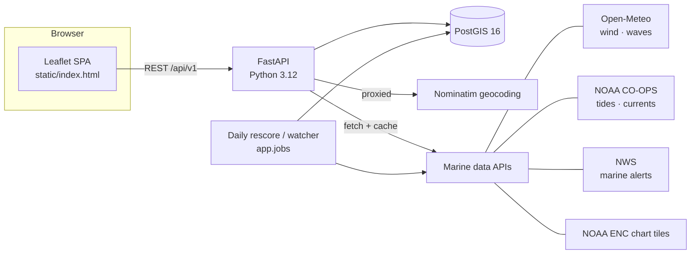

# SailReady (sailready.ai)

**A go/no-go decision engine for sailors.** You describe a trip — a route, a
departure and return-by time, and your boat — and SailReady simulates the voyage
against real marine forecasts, tides, currents, and charted depths, then answers
the only question that matters before you cast off: **should I go?**

The answer is a 0–100 readiness score with the *reasons* behind it ("gusts to 29 kt
on the return leg exceed your 24 kt limit", "you'd ground at waypoint 2 on the
outbound tide"), not just a number. It is conservative by design: the score is the
**worst** constraint, never an average, because the ocean doesn't average.

> Full design spec: [SPEC.md](SPEC.md)

---

## Table of contents

- [What it does](#what-it-does)
- [How a trip is scored](#how-a-trip-is-scored)
- [The grounding (depth) check](#the-grounding-depth-check)
- [Architecture](#architecture)
- [External data sources (the public APIs)](#external-data-sources-the-public-apis)
- [Maps & nautical charts](#maps--nautical-charts)
- [Data model](#data-model)
- [REST API](#rest-api)
- [Authentication](#authentication)
- [Running it locally](#running-it-locally)
- [Project layout](#project-layout)
- [The `temporal-poc` branch](#the-temporal-poc-branch)
- [Data attribution](#data-attribution)

---

## What it does

- **Plan a trip** — pick a boat, draw a route as ordered waypoints, set a departure
  time and a return-by deadline, and how long you intend to stay at the destination.
- **Score it** — SailReady walks the route outbound and back as a time-stepped
  simulation, sampling the forecast **at each waypoint at the time you'll actually be
  there** (a slow, current-fought leg pushes the next waypoint's sample later — it's a
  feedback loop, not a static snapshot). It checks wind, gusts, waves, adverse
  current, thunderstorms/precip, grounding depth, and whether the round trip even fits
  inside your window, then returns a score, a feasible/not-feasible verdict, the list
  of reasons ("drivers"), and concrete suggestions ("leave 2 h earlier", "shorten the
  stay").
- **Avoid running aground** — every waypoint is checked against NOAA electronic
  navigational chart (ENC) depths combined with the predicted tide and your boat's
  draft, with a configurable safety margin.
- **Know your turn-around time** — the latest you can leave the destination and still
  make it home inside your window, found by binary search over the return simulation.
- **See it on the chart** — a Leaflet map with a live NOAA nautical-chart overlay,
  OpenSeaMap seamarks, and draggable waypoints.
- **Stay informed** — in-app notifications when conditions degrade, plus a daily
  rescore of upcoming trips.

## How a trip is scored

The engine entry point is `rescore_trip()` in `backend/app/engine/runner.py`, called
identically by the API and the daily rescore job:

1. **Load the boat profile and waypoints.** Each waypoint's charted depth facts
   (`charts/depth.py`) are looked up once up front.
2. **Fetch conditions** for each waypoint over a padded time window
   (`departure − 3 h` … `return_by + 8 h`) so the simulation has room to probe
   leave-earlier options and search for the turn-around deadline.
3. **Simulate** (`engine/scoring.py`, `score_trip`). Waypoints are walked outbound
   then reversed for the return. Per leg, boat speed comes from a sail/motor
   performance model (polars, upwind no-go zone with VMG tacking), then along-course
   current is applied to get speed-over-ground. The clock advances by each leg's
   duration, so later waypoints are sampled at later forecast hours.
4. **Check constraints** at each visit and convert each to a 0–100 contribution:

   | Constraint | Source | Violation when |
   |---|---|---|
   | Wind (sustained) | Open-Meteo | exceeds boat's `max_wind_kts` |
   | Gusts | Open-Meteo | exceeds `max_wind_kts × 1.2` |
   | Waves | Open-Meteo Marine | exceeds boat's `max_wave_ft` |
   | Adverse current | NOAA CO-OPS | foul component exceeds `max_adverse_current_kts` |
   | Thunderstorms / precip | Open-Meteo (WMO codes) | codes 95/96/99 → hard No-Go |
   | Depth / grounding | NOAA ENC + tide | see below |
   | Time budget | simulation | round trip doesn't fit the window |
   | Marine warnings | NWS api.weather.gov | Small Craft Advisory etc. caps the score |

5. **Aggregate.** `score = min(all constraint contributions)` — the single worst thing
   sets the score. `feasible = (no constraint is a "violation")`. Severity bands:
   `ok` (ratio < 0.85), `warning` (0.85–1.0, score 60–89), `violation` (ratio > 1.0,
   score ≤ 40). **Any one violation makes the whole trip infeasible.**
6. **Persist** the `TripScore` plus its `ScoreDriver` rows, and notify on material
   changes.

The result also includes a `turn_around_deadline`, a `max_reachable_distance_nm`, a
human-readable `conditions_summary` (measured value vs. limit per constraint), and
`suggestions`.

## The grounding (depth) check

At each waypoint visit (tide differs outbound vs. return, so it's checked per visit):

```
available_ft = charted_depth_below_MLLW + predicted_tide_height
required_ft  = boat_draft + grounding_margin
```

- Charted depth is the **conservative minimum** of the ENC depth area the point falls
  in (`DRVAL1`, the shallow edge of the band) — not a nearby sounding. This is
  deliberate: a grounding check should assume the shallow edge.
- `available ≤ 0` → "dries at this tide", hard violation.
- Otherwise the `required/available` ratio feeds the same severity bands as everything
  else.
- A waypoint on charted **land** or in **unsurveyed** water is flagged directly.
- **`depth_acknowledged`** lets a skipper with local knowledge of a spot suppress the
  *score penalty* (the chart math still shows as an informational warning). It never
  applies to charted land.

The model is datum-correct at zero margin; the margin is skipper comfort padding for
negative tides, wind setdown, and sounding error.

## Architecture



- **Backend:** FastAPI (async), SQLAlchemy 2 over **PostGIS** (geospatial Postgres).
- **Frontend:** a single static-HTML **Leaflet** SPA (`backend/app/static/index.html`)
  served by the API — no build step.
- **Datastore:** PostGIS holds users/boats/trips/scores **and** the ingested ENC chart
  geometry (depth areas, soundings, hazards, land), plus a conditions cache and a
  rendered-tile cache.
- **Security:** the API connects as an RLS-constrained DB role (`sailready_app`) — Postgres
  **row-level security** scopes every query to the current user at the database layer,
  so a bug in application code still can't leak another user's data.

## External data sources (the public APIs)

Every external call is server-side via `httpx`, cached in Postgres (`conditions/service.py`)
so the upstream is hit only on a cache miss. All five providers are free / public:

| Provider | Endpoint | What we pull | Code |
|---|---|---|---|
| **Open-Meteo — Forecast** | `https://api.open-meteo.com/v1/forecast` | hourly **wind** (sustained, gusts, direction), precipitation, WMO weather code | `conditions/openmeteo.py` |
| **Open-Meteo — Marine** | `https://marine-api.open-meteo.com/v1/marine` | hourly **wave** height, direction, period | `conditions/openmeteo.py` |
| **NOAA CO-OPS Tides & Currents** | `https://api.tidesandcurrents.noaa.gov/api/prod/datagetter` (+ `mdapi` for stations) | **tide** predictions (hourly height, MLLW) and **tidal current** predictions (speed + flood/ebb); nearest-station lookup with interpolation | `conditions/coops.py` |
| **NWS / NOAA Weather** | `https://api.weather.gov/alerts/active` | active **marine alerts/warnings** (e.g. Small Craft Advisory) — severity, headline, timing | `conditions/nws.py` |
| **NOAA Maritime Chart Service (ENC Online)** | `https://gis.charttools.noaa.gov/.../MaritimeChartService/MapServer/export` | rendered **nautical chart PNG tiles** (live, per-bbox) | `charts/tiles.py` |
| **Nominatim (OpenStreetMap)** | `https://nominatim.openstreetmap.org/search` | **geocoding** (place name → lat/lon), proxied server-side | `api/geocode.py` |

There is intentionally **no** third-party LLM, email SaaS, payments, or analytics
provider. Outbound email goes to a local SMTP catcher (Mailpit) in development.

## Maps & nautical charts

Two distinct chart pipelines:

1. **Raster chart overlay (display).** The browser's Leaflet map layers three tile
   sources:
   - **OpenStreetMap** base map — `tile.openstreetmap.org`
   - **NOAA ENC overlay** — served by our own proxy endpoint
     `GET /api/v1/charts/enc-tile/{z}/{x}/{y}.png`, which fetches from NOAA's Maritime
     Chart Service and **caches each tile in Postgres for 7 days** (`charts/tiles.py`);
     `make warm-tiles` pre-renders a bounding box.
   - **OpenSeaMap** seamark overlay — `tiles.openseamap.org` (toggleable)
   - Map library is **Leaflet 1.9.4** (from unpkg CDN).

2. **Vector ENC ingest (depth/grounding data).** NOAA **S-57 ENC cells** (downloaded
   out-of-band into `data/enc/`) are parsed via GDAL by `make ingest-enc`
   (`charts/ingest_enc.py`) into PostGIS tables: depth areas (`enc_depth_areas`,
   including dredged channels), soundings (`enc_soundings`), hazards/obstructions/wrecks
   (`enc_hazards`), and land (`enc_land`). The grounding check queries these directly —
   no live API call. Exposed for inspection at `GET /api/v1/charts/depth?lat=&lon=`.

## Data model

Core tables (`backend/app/models.py`), all user-scoped rows protected by RLS:

- **User** — identity, home port, alert thresholds, default boat.
- **Boat** — physical (LOA, **draft**, air draft, beam), performance (hull/motor/sail
  speeds, upwind angle), and comfort limits (`max_wind_kts`, `max_wave_ft`,
  `max_adverse_current_kts`, `grounding_margin_ft`).
- **Trip** — boat + route + `departure_time` / `return_by_time` /
  `time_at_destination_hrs`, status (`planning → active → completed/cancelled`), and a
  cached current score.
- **RouteWaypoint** — ordered PostGIS points, `waypoint_type` (start/intermediate/
  destination), `leg_mode`, `depth_acknowledged`.
- **TripScore** — `score`, `feasible`, `turn_around_deadline`,
  `max_reachable_distance_nm`, and JSON `legs` / `conditions_summary` / `suggestions`;
  one current row per forecast date.
- **ScoreDriver** — the per-constraint reasons attached to a score: `constraint_type`,
  `severity`, `leg`, `waypoint_order`, `actual_value` vs `threshold_value`, and a
  human description.
- Plus **SavedRoute**, **TripFeedback**, **Notification**, and a shared
  **ConditionsCache** (the one non-user-scoped table).

## REST API

All endpoints are under `/api/v1` and return a generic `Envelope` wrapper.
Interactive docs at `http://localhost:8000/docs`.

| Area | Endpoints |
|---|---|
| Users | `GET/PUT /users/me` |
| Boats | `GET/POST /boats`, `GET/PUT/DELETE /boats/{id}` |
| Trips | `GET/POST /trips`, `GET/PUT/DELETE /trips/{id}`, `PUT /trips/{id}/status`, `GET/PUT /trips/{id}/waypoints` |
| Scoring | `POST /trips/{id}/score`, `GET /trips/{id}/scores` |
| Saved routes | `GET/POST /routes`, `GET/DELETE /routes/{id}`, `POST /routes/{id}/trip` |
| Feedback | `POST/GET /trips/{id}/feedback` |
| Notifications | `GET /notifications`, `PUT /notifications/{id}/read`, `PUT /notifications/read-all` |
| Conditions | `GET /conditions` |
| Charts | `GET /charts/depth`, `GET /charts/enc-tile/{z}/{x}/{y}.png` |
| Geocoding | `GET /geocode` |

## Authentication

`backend/app/auth.py`, selected by `AUTH_MODE`:

- **`dev`** — every request is the configured dev user (local development).
- **`proxy`** — trusts `X-Forwarded-Email` from an oauth2-proxy in front (the POC cloud
  deploy uses Google sign-in + an allowlist at the proxy; see `deploy/`).
- **`cognito`** — AWS Cognito JWT validation (stubbed; arrives with the AWS deploy).

In every mode the resolved user is bound into the DB session (`set_config('app.current_user_id', …)`)
to drive row-level security.

## Running it locally

Requirements: Docker + Docker Compose.

```bash
cp .env.example .env     # then edit: set POSTGRES_PASSWORD / APP_DB_PASSWORD / TEMPORAL_DB_PASSWORD
make up                  # build + start PostGIS, API (hot reload), Mailpit
make migrate             # apply database migrations (creates schema, RLS, app role)
```

- App UI: http://localhost:8000/app
- API docs: http://localhost:8000/docs
- Mailpit (catches outbound email): http://localhost:8025

Credentials are **not** committed — the compose files and the initial migration read
`POSTGRES_PASSWORD`, `APP_DB_PASSWORD`, and `TEMPORAL_DB_PASSWORD` from your gitignored
`.env` (template in `.env.example`).

Optional data steps:

```bash
make ingest-enc          # load NOAA S-57 ENC cells from data/enc/ into PostGIS
make warm-tiles          # pre-render the NOAA chart-tile cache for a bbox
make rescore             # re-score upcoming trips (the daily job, on demand)
make test                # pytest
```

Database roles: `sailready` (admin/migrations, owns schema and RLS policies) and
`sailready_app` (what the API connects as — RLS-enforced).

## Project layout

```
backend/
  app/
    api/          REST routers (trips, boats, scores, charts, geocode, …)
    engine/       scoring simulation (scoring.py) + orchestration (runner.py)
    conditions/   external marine-data clients + Postgres cache
    charts/       ENC ingest, depth lookup, NOAA tile proxy/cache
    jobs/         daily rescore + condition watcher
    static/       the Leaflet single-page UI
    models.py     SQLAlchemy / PostGIS schema
  alembic/        database migrations (schema, RLS policies, app role)
deploy/           single-VM POC deploy (Caddy TLS, oauth2-proxy Google auth)
docker-compose.yml
SPEC.md           design source of truth
```

## The `temporal-poc` branch

The [`temporal-poc`](../../tree/temporal-poc) branch replaces the polling trip-watcher
with a **durable, per-trip [Temporal](https://temporal.io) workflow** — one long-lived
workflow instance per trip that paces rechecks on a tightening cadence, reacts to
signals (edit, cancel, GPS position), exposes live state via a query, and survives
worker/host failure by resuming from event history. See that branch's
`docs/` for the design and an account of how it rides out upstream (NOAA) outages that
would otherwise fail a scoring run.

## Data attribution

- Weather & marine forecasts: **Open-Meteo** (CC BY 4.0).
- Tides, currents, ENC charts, marine alerts: **NOAA** / **NWS** (U.S. Government, public domain).
- Base map & geocoding: **OpenStreetMap** contributors (ODbL) via Nominatim; seamarks via **OpenSeaMap**.

This is a planning aid, **not** a substitute for official charts, prudent seamanship, or
a proper float plan. Always verify with current official sources before getting underway.
